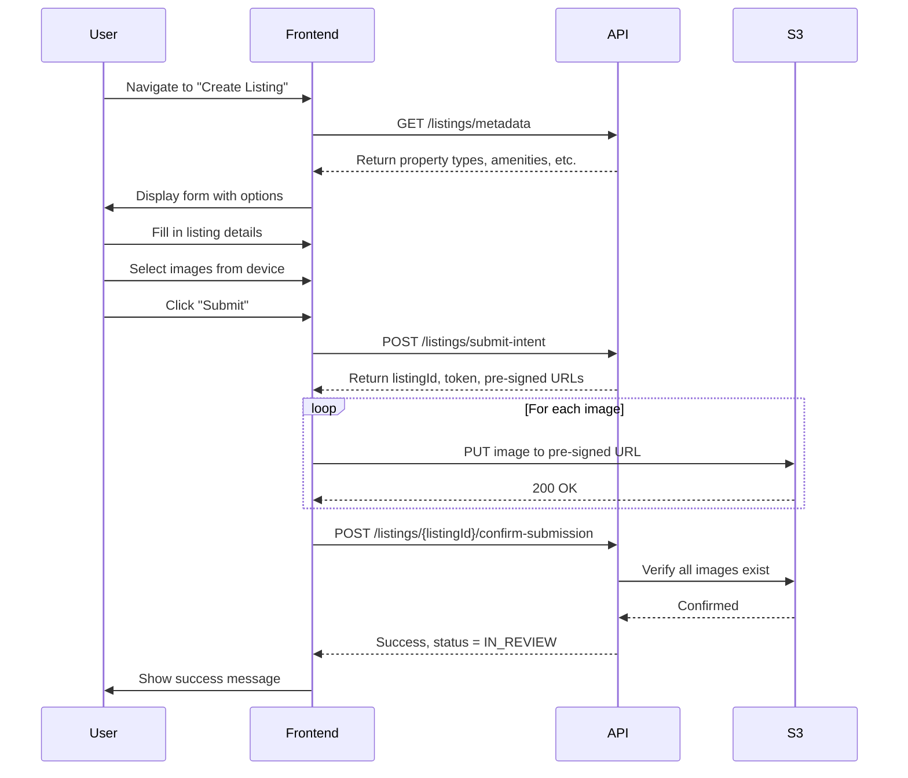

# Property Listings API Specification

**Version:** 1.0.0  
**Environment:** dev1  
**Base URL:** `https://tqaq505m83.execute-api.eu-north-1.amazonaws.com/dev1`  
**Last Updated:** October 25, 2025

---

## Table of Contents

1. [Overview](#overview)
2. [Authentication](#authentication)
3. [API Endpoints](#api-endpoints)
4. [Data Models](#data-models)
5. [Workflows](#workflows)
6. [Error Handling](#error-handling)
7. [Examples](#examples)

---

## Overview

The Property Listings API allows hosts to create, manage, and delete property listings. The API uses a two-step submission process similar to profile submission:

1. **Submit Intent:** Send listing metadata and receive pre-signed S3 URLs for image/document uploads
2. **Confirm Submission:** After uploading files to S3, confirm the submission to finalize the listing

### Key Features

- ✅ Two-step phased submission (metadata first, then file uploads)
- ✅ Pre-signed S3 URLs for direct client-side uploads
- ✅ Subscription limit enforcement (based on host's plan)
- ✅ Bilingual data (English and Serbian) for all metadata
- ✅ Soft delete with cascade to related records
- ✅ Status workflow: DRAFT → IN_REVIEW → APPROVED → ONLINE

---

## Authentication

All endpoints require a valid JWT token obtained from Cognito authentication.

### Headers Required

```http
Authorization: Bearer <JWT_TOKEN>
Content-Type: application/json
```

### JWT Claims Used

- `hostId` - Used for authorization and data access
- `hostStatus` - Checked for profile completion
- `role` - User role (HOST, ADMIN)

---

## API Endpoints

### 1. Get Listing Metadata

Retrieve all configuration data needed to build listing creation forms.

```http
GET /api/v1/listings/metadata
```

**Authentication:** Required  
**Rate Limit:** 100 requests/minute

#### Response (200 OK)

```json
{
  "propertyTypes": [
    {
      "value": "APARTMENT",
      "label": {
        "en": "Apartment",
        "sr": "Apartman"
      },
      "description": {
        "en": "A self-contained housing unit in a building",
        "sr": "Samostalna stambena jedinica u zgradi"
      },
      "metadata": {
        "isEntirePlace": true
      }
    },
    {
      "value": "HOUSE",
      "label": {
        "en": "House",
        "sr": "Kuća"
      },
      "description": {
        "en": "A standalone residential building",
        "sr": "Samostojeća stambena zgrada"
      },
      "metadata": {
        "isEntirePlace": true
      }
    },
    {
      "value": "VILLA",
      "label": {
        "en": "Villa",
        "sr": "Vila"
      },
      "description": {
        "en": "A luxurious standalone house",
        "sr": "Luksuzna samostojeća kuća"
      },
      "metadata": {
        "isEntirePlace": true
      }
    },
    {
      "value": "STUDIO",
      "label": {
        "en": "Studio",
        "sr": "Studio"
      },
      "description": {
        "en": "A single-room apartment",
        "sr": "Jednosoban stan"
      },
      "metadata": {
        "isEntirePlace": true
      }
    },
    {
      "value": "ROOM",
      "label": {
        "en": "Room",
        "sr": "Soba"
      },
      "description": {
        "en": "A private room in a shared property",
        "sr": "Privatna soba u deljenom prostoru"
      },
      "metadata": {
        "isEntirePlace": false
      }
    }
  ],
  "amenities": [
    {
      "value": "WIFI",
      "label": {
        "en": "WiFi",
        "sr": "WiFi"
      },
      "category": "BASICS"
    },
    {
      "value": "AIR_CONDITIONING",
      "label": {
        "en": "Air Conditioning",
        "sr": "Klima uređaj"
      },
      "category": "BASICS"
    },
    {
      "value": "KITCHEN",
      "label": {
        "en": "Kitchen",
        "sr": "Kuhinja"
      },
      "category": "KITCHEN"
    }
    // ... 40 more amenities
  ],
  "checkInTypes": [
    {
      "value": "SELF_CHECKIN",
      "label": {
        "en": "Self Check-in",
        "sr": "Samostalni prijava"
      },
      "description": {
        "en": "Guests can check in themselves",
        "sr": "Gosti se mogu sami prijaviti"
      }
    },
    {
      "value": "HOST_GREETING",
      "label": {
        "en": "Host Greeting",
        "sr": "Domaćin dočekuje"
      },
      "description": {
        "en": "Host will greet guests on arrival",
        "sr": "Domaćin će dočekati goste po dolasku"
      }
    },
    {
      "value": "LOCKBOX",
      "label": {
        "en": "Lockbox",
        "sr": "Sef za ključeve"
      },
      "description": {
        "en": "Key is in a lockbox",
        "sr": "Ključ je u sefu"
      }
    },
    {
      "value": "DOORMAN",
      "label": {
        "en": "Doorman",
        "sr": "Portir"
      },
      "description": {
        "en": "Building doorman will provide access",
        "sr": "Portir zgrade će omogućiti pristup"
      }
    }
  ],
  "parkingTypes": [
    {
      "value": "NO_PARKING",
      "label": {
        "en": "No Parking",
        "sr": "Bez parkinga"
      },
      "description": {
        "en": "No parking available",
        "sr": "Parking nije dostupan"
      }
    },
    {
      "value": "FREE",
      "label": {
        "en": "Free Parking",
        "sr": "Besplatan parking"
      },
      "description": {
        "en": "Free parking on premises",
        "sr": "Besplatan parking na licu mesta"
      }
    },
    {
      "value": "PAID",
      "label": {
        "en": "Paid Parking",
        "sr": "Plaćeni parking"
      },
      "description": {
        "en": "Paid parking available",
        "sr": "Plaćeni parking dostupan"
      }
    }
  ],
  "verificationDocumentTypes": [
    {
      "value": "PROOF_OF_OWNERSHIP",
      "label": {
        "en": "Proof of Ownership",
        "sr": "Dokaz o vlasništvu"
      },
      "description": {
        "en": "Document proving property ownership",
        "sr": "Dokument koji dokazuje vlasništvo nad nekretninom"
      }
    },
    {
      "value": "PROOF_OF_RIGHT_TO_LIST",
      "label": {
        "en": "Proof of Right to List",
        "sr": "Dokaz o pravu iznajmljivanja"
      },
      "description": {
        "en": "Authorization to list the property",
        "sr": "Ovlašćenje za iznajmljivanje nekretnine"
      }
    },
    {
      "value": "PROOF_OF_ADDRESS",
      "label": {
        "en": "Proof of Address",
        "sr": "Dokaz o adresi"
      },
      "description": {
        "en": "Document confirming property address",
        "sr": "Dokument koji potvrđuje adresu nekretnine"
      }
    },
    {
      "value": "EXISTING_PROFILE_PROOF",
      "label": {
        "en": "Existing Profile Proof",
        "sr": "Dokaz o postojećem profilu"
      },
      "description": {
        "en": "Proof of existing listing on other platforms",
        "sr": "Dokaz o postojećem oglasu na drugim platformama"
      }
    }
  ],
  "listingStatuses": [
    {
      "value": "DRAFT",
      "label": {
        "en": "Draft",
        "sr": "Nacrt"
      },
      "description": {
        "en": "Listing is being created",
        "sr": "Oglas se kreira"
      }
    },
    {
      "value": "IN_REVIEW",
      "label": {
        "en": "In Review",
        "sr": "Na pregledu"
      },
      "description": {
        "en": "Listing is under review",
        "sr": "Oglas je na pregledu"
      }
    },
    {
      "value": "APPROVED",
      "label": {
        "en": "Approved",
        "sr": "Odobren"
      },
      "description": {
        "en": "Listing has been approved",
        "sr": "Oglas je odobren"
      }
    },
    {
      "value": "REJECTED",
      "label": {
        "en": "Rejected",
        "sr": "Odbijen"
      },
      "description": {
        "en": "Listing was rejected",
        "sr": "Oglas je odbijen"
      }
    },
    {
      "value": "ONLINE",
      "label": {
        "en": "Online",
        "sr": "Online"
      },
      "description": {
        "en": "Listing is live and bookable",
        "sr": "Oglas je aktivan i dostupan za rezervaciju"
      }
    },
    {
      "value": "OFFLINE",
      "label": {
        "en": "Offline",
        "sr": "Offline"
      },
      "description": {
        "en": "Listing is temporarily unavailable",
        "sr": "Oglas je privremeno nedostupan"
      }
    },
    {
      "value": "LOCKED",
      "label": {
        "en": "Locked",
        "sr": "Zaključan"
      },
      "description": {
        "en": "Listing is locked by admin",
        "sr": "Oglas je zaključan od strane admina"
      }
    },
    {
      "value": "ARCHIVED",
      "label": {
        "en": "Archived",
        "sr": "Arhiviran"
      },
      "description": {
        "en": "Listing has been archived",
        "sr": "Oglas je arhiviran"
      }
    }
  ],
  "amenityCategories": [
    {
      "value": "BASICS",
      "label": {
        "en": "Basics",
        "sr": "Osnovno"
      }
    },
    {
      "value": "KITCHEN",
      "label": {
        "en": "Kitchen",
        "sr": "Kuhinja"
      }
    },
    {
      "value": "LAUNDRY",
      "label": {
        "en": "Laundry",
        "sr": "Veš"
      }
    },
    {
      "value": "ENTERTAINMENT",
      "label": {
        "en": "Entertainment",
        "sr": "Zabava"
      }
    },
    {
      "value": "OUTDOOR",
      "label": {
        "en": "Outdoor",
        "sr": "Napolju"
      }
    },
    {
      "value": "BUILDING",
      "label": {
        "en": "Building",
        "sr": "Zgrada"
      }
    },
    {
      "value": "FAMILY",
      "label": {
        "en": "Family",
        "sr": "Porodica"
      }
    },
    {
      "value": "ACCESSIBILITY",
      "label": {
        "en": "Accessibility",
        "sr": "Pristupačnost"
      }
    },
    {
      "value": "SAFETY",
      "label": {
        "en": "Safety",
        "sr": "Bezbednost"
      }
    },
    {
      "value": "WORK",
      "label": {
        "en": "Work",
        "sr": "Rad"
      }
    }
  ]
}
```

**Notes:**

- Call this endpoint once when the user navigates to the "Create Listing" page
- Cache the response for the session to avoid repeated calls
- Use the bilingual labels to display options based on user's preferred language

---

### 2. Submit Listing Intent

Create a new listing and receive pre-signed S3 URLs for image and document uploads.

```http
POST /api/v1/hosts/{hostId}/listings/submit-intent
```

**Authentication:** Required  
**Authorization:** User must be able to access `{hostId}`  
**Rate Limit:** 10 requests/minute

#### Request Body

```json
{
  "listingName": "Beautiful 2BR Apartment in City Center",
  "propertyType": "APARTMENT",
  "description": "A spacious and modern 2-bedroom apartment located in the heart of the city. Perfect for families or business travelers. Walking distance to restaurants, shops, and public transport.",
  "address": {
    "street": "Knez Mihailova 15",
    "city": "Belgrade",
    "state": "Belgrade",
    "postalCode": "11000",
    "country": "RS",
    "coordinates": {
      "latitude": 44.8176,
      "longitude": 20.4568
    }
  },
  "capacity": {
    "beds": 2,
    "sleeps": 4
  },
  "pricing": {
    "pricePerNight": 75.0,
    "currency": "EUR"
  },
  "pets": {
    "allowed": false,
    "description": null
  },
  "checkIn": {
    "type": "SELF_CHECKIN",
    "description": "Key code will be sent 24 hours before arrival",
    "checkInFrom": "14:00",
    "checkOutBy": "11:00"
  },
  "parking": {
    "type": "FREE",
    "description": "Free parking in building garage"
  },
  "amenities": [
    "WIFI",
    "AIR_CONDITIONING",
    "HEATING",
    "KITCHEN",
    "TV",
    "WASHER"
  ],
  "images": [
    {
      "imageId": "img_001",
      "contentType": "image/jpeg",
      "isPrimary": true,
      "displayOrder": 1,
      "caption": "Living room with city view"
    },
    {
      "imageId": "img_002",
      "contentType": "image/jpeg",
      "isPrimary": false,
      "displayOrder": 2,
      "caption": "Master bedroom"
    },
    {
      "imageId": "img_003",
      "contentType": "image/jpeg",
      "isPrimary": false,
      "displayOrder": 3,
      "caption": "Modern kitchen"
    }
  ],
  "verificationDocuments": [
    {
      "documentType": "PROOF_OF_OWNERSHIP",
      "contentType": "application/pdf"
    }
  ]
}
```

#### Field Validation Rules

| Field                                  | Type    | Required | Validation                                                                                   |
| -------------------------------------- | ------- | -------- | -------------------------------------------------------------------------------------------- |
| `listingName`                          | string  | ✅ Yes   | 3-200 characters                                                                             |
| `propertyType`                         | enum    | ✅ Yes   | One of: APARTMENT, HOUSE, VILLA, STUDIO, ROOM                                                |
| `description`                          | string  | ✅ Yes   | 50-5000 characters                                                                           |
| `address.street`                       | string  | ✅ Yes   | 1-200 characters                                                                             |
| `address.city`                         | string  | ✅ Yes   | 1-100 characters                                                                             |
| `address.state`                        | string  | ❌ No    | 1-100 characters                                                                             |
| `address.postalCode`                   | string  | ✅ Yes   | 1-20 characters                                                                              |
| `address.country`                      | string  | ✅ Yes   | ISO 3166-1 alpha-2 code (e.g., "RS", "US")                                                   |
| `address.coordinates.latitude`         | number  | ✅ Yes   | -90 to 90                                                                                    |
| `address.coordinates.longitude`        | number  | ✅ Yes   | -180 to 180                                                                                  |
| `capacity.beds`                        | number  | ✅ Yes   | 1-50                                                                                         |
| `capacity.sleeps`                      | number  | ✅ Yes   | 1-100                                                                                        |
| `pricing.pricePerNight`                | number  | ✅ Yes   | > 0                                                                                          |
| `pricing.currency`                     | string  | ✅ Yes   | ISO 4217 code (e.g., "EUR", "USD")                                                           |
| `pets.allowed`                         | boolean | ✅ Yes   | true or false                                                                                |
| `pets.description`                     | string  | ❌ No    | 0-500 characters                                                                             |
| `checkIn.type`                         | enum    | ✅ Yes   | One of: SELF_CHECKIN, HOST_GREETING, LOCKBOX, DOORMAN                                        |
| `checkIn.description`                  | string  | ❌ No    | 0-500 characters                                                                             |
| `checkIn.checkInFrom`                  | string  | ✅ Yes   | HH:MM format (e.g., "14:00")                                                                 |
| `checkIn.checkOutBy`                   | string  | ✅ Yes   | HH:MM format (e.g., "11:00")                                                                 |
| `parking.type`                         | enum    | ✅ Yes   | One of: NO_PARKING, FREE, PAID                                                               |
| `parking.description`                  | string  | ❌ No    | 0-500 characters                                                                             |
| `amenities`                            | array   | ✅ Yes   | 1-50 amenity codes                                                                           |
| `images`                               | array   | ✅ Yes   | 1-15 images, exactly 1 must have `isPrimary: true`                                           |
| `images[].imageId`                     | string  | ✅ Yes   | Unique identifier (e.g., UUID)                                                               |
| `images[].contentType`                 | string  | ✅ Yes   | `image/jpeg`, `image/png`, or `image/webp`                                                   |
| `images[].isPrimary`                   | boolean | ✅ Yes   | Exactly one image must be primary                                                            |
| `images[].displayOrder`                | number  | ✅ Yes   | 1-15, unique per listing                                                                     |
| `images[].caption`                     | string  | ❌ No    | 0-200 characters                                                                             |
| `verificationDocuments`                | array   | ❌ No    | 0-10 documents                                                                               |
| `verificationDocuments[].documentType` | enum    | ✅ Yes   | One of: PROOF_OF_OWNERSHIP, PROOF_OF_RIGHT_TO_LIST, PROOF_OF_ADDRESS, EXISTING_PROFILE_PROOF |
| `verificationDocuments[].contentType`  | string  | ✅ Yes   | `application/pdf`, `image/jpeg`, or `image/png`                                              |

#### Response (200 OK)

```json
{
  "listingId": "lst_abc123xyz",
  "submissionToken": "eyJhbGciOiJIUzI1NiIsInR5cCI6IkpXVCJ9...",
  "expiresAt": "2025-10-25T17:30:00.000Z",
  "imageUploadUrls": [
    {
      "imageId": "img_001",
      "uploadUrl": "https://localstays-dev1-host-assets.s3.eu-north-1.amazonaws.com/...",
      "expiresAt": "2025-10-25T17:30:00.000Z"
    },
    {
      "imageId": "img_002",
      "uploadUrl": "https://localstays-dev1-host-assets.s3.eu-north-1.amazonaws.com/...",
      "expiresAt": "2025-10-25T17:30:00.000Z"
    },
    {
      "imageId": "img_003",
      "uploadUrl": "https://localstays-dev1-host-assets.s3.eu-north-1.amazonaws.com/...",
      "expiresAt": "2025-10-25T17:30:00.000Z"
    }
  ],
  "documentUploadUrls": [
    {
      "documentType": "PROOF_OF_OWNERSHIP",
      "uploadUrl": "https://localstays-dev1-host-assets.s3.eu-north-1.amazonaws.com/...",
      "expiresAt": "2025-10-25T17:30:00.000Z"
    }
  ]
}
```

#### Error Responses

**400 Bad Request** - Validation error

```json
{
  "error": "ValidationError",
  "message": "Validation failed",
  "details": {
    "listingName": "Listing name must be at least 3 characters",
    "images": "Exactly one image must be marked as primary"
  }
}
```

**403 Forbidden** - Subscription limit reached

```json
{
  "error": "SubscriptionLimitReached",
  "message": "You have reached the maximum number of listings for your subscription plan",
  "details": {
    "currentPlan": "FREE",
    "maxListings": 2,
    "currentListings": 2
  }
}
```

**Notes:**

- The `submissionToken` expires in 30 minutes
- Pre-signed URLs expire in 30 minutes
- Store the `listingId` and `submissionToken` for the next step
- Upload files to S3 using the pre-signed URLs (see [S3 Upload Instructions](#s3-upload-instructions))

---

### 3. Confirm Listing Submission

After uploading all images and documents to S3, confirm the submission to finalize the listing.

```http
POST /api/v1/hosts/{hostId}/listings/{listingId}/confirm-submission
```

**Authentication:** Required  
**Authorization:** User must be able to access `{hostId}` and own `{listingId}`  
**Rate Limit:** 10 requests/minute

#### Request Body

```json
{
  "submissionToken": "eyJhbGciOiJIUzI1NiIsInR5cCI6IkpXVCJ9...",
  "uploadedImages": ["img_001", "img_002", "img_003"],
  "uploadedDocuments": ["PROOF_OF_OWNERSHIP"]
}
```

#### Field Validation Rules

| Field               | Type   | Required | Validation                                             |
| ------------------- | ------ | -------- | ------------------------------------------------------ |
| `submissionToken`   | string | ✅ Yes   | JWT token from submit-intent response                  |
| `uploadedImages`    | array  | ✅ Yes   | Array of imageIds that were successfully uploaded      |
| `uploadedDocuments` | array  | ❌ No    | Array of documentTypes that were successfully uploaded |

#### Response (200 OK)

```json
{
  "success": true,
  "listingId": "lst_abc123xyz",
  "status": "IN_REVIEW",
  "message": "Listing submitted successfully and is now under review"
}
```

#### Error Responses

**400 Bad Request** - Invalid or expired token

```json
{
  "error": "InvalidToken",
  "message": "Submission token is invalid or expired"
}
```

**400 Bad Request** - Missing images

```json
{
  "error": "MissingImages",
  "message": "Not all images were uploaded to S3",
  "details": {
    "expectedImages": ["img_001", "img_002", "img_003"],
    "uploadedImages": ["img_001", "img_002"],
    "missingImages": ["img_003"]
  }
}
```

**400 Bad Request** - Missing documents

```json
{
  "error": "MissingDocuments",
  "message": "Not all documents were uploaded to S3",
  "details": {
    "expectedDocuments": ["PROOF_OF_OWNERSHIP"],
    "uploadedDocuments": [],
    "missingDocuments": ["PROOF_OF_OWNERSHIP"]
  }
}
```

**Notes:**

- The backend verifies that all declared images/documents exist in S3
- After successful confirmation, the listing status changes from DRAFT to IN_REVIEW
- The listing will be reviewed by an admin before being approved

---

### 4. List Listings

Retrieve a paginated list of all listings for a host.

```http
GET /api/v1/hosts/{hostId}/listings?status=DRAFT&limit=20&lastEvaluatedKey=...
```

**Authentication:** Required  
**Authorization:** User must be able to access `{hostId}`  
**Rate Limit:** 100 requests/minute

#### Query Parameters

| Parameter          | Type   | Required | Description                                                 |
| ------------------ | ------ | -------- | ----------------------------------------------------------- |
| `status`           | string | ❌ No    | Filter by listing status (DRAFT, IN_REVIEW, APPROVED, etc.) |
| `limit`            | number | ❌ No    | Number of results to return (default: 20, max: 100)         |
| `lastEvaluatedKey` | string | ❌ No    | Pagination token from previous response                     |

#### Response (200 OK)

```json
{
  "listings": [
    {
      "listingId": "lst_abc123xyz",
      "listingName": "Beautiful 2BR Apartment in City Center",
      "propertyType": {
        "value": "APARTMENT",
        "label": {
          "en": "Apartment",
          "sr": "Apartman"
        }
      },
      "status": "IN_REVIEW",
      "address": {
        "city": "Belgrade",
        "country": "RS"
      },
      "pricing": {
        "pricePerNight": 75.0,
        "currency": "EUR"
      },
      "capacity": {
        "beds": 2,
        "sleeps": 4
      },
      "primaryImage": {
        "imageId": "img_001",
        "url": "https://localstays-dev1-host-assets.s3.eu-north-1.amazonaws.com/...",
        "caption": "Living room with city view"
      },
      "createdAt": "2025-10-25T16:45:00.000Z",
      "updatedAt": "2025-10-25T16:50:00.000Z",
      "submittedAt": "2025-10-25T16:50:00.000Z"
    },
    {
      "listingId": "lst_def456uvw",
      "listingName": "Cozy Studio Near University",
      "propertyType": {
        "value": "STUDIO",
        "label": {
          "en": "Studio",
          "sr": "Studio"
        }
      },
      "status": "APPROVED",
      "address": {
        "city": "Belgrade",
        "country": "RS"
      },
      "pricing": {
        "pricePerNight": 45.0,
        "currency": "EUR"
      },
      "capacity": {
        "beds": 1,
        "sleeps": 2
      },
      "primaryImage": {
        "imageId": "img_101",
        "url": "https://localstays-dev1-host-assets.s3.eu-north-1.amazonaws.com/...",
        "caption": "Bright and modern studio"
      },
      "createdAt": "2025-10-20T10:30:00.000Z",
      "updatedAt": "2025-10-21T14:20:00.000Z",
      "submittedAt": "2025-10-20T11:00:00.000Z",
      "approvedAt": "2025-10-21T14:20:00.000Z"
    }
  ],
  "count": 2,
  "lastEvaluatedKey": null
}
```

**Notes:**

- Use this endpoint to display a list/grid of the host's listings
- If `lastEvaluatedKey` is present in the response, there are more results available
- Pass `lastEvaluatedKey` to the next request to fetch the next page
- Listings are sorted by creation date (newest first)

---

### 5. Get Listing Details

Retrieve full details for a specific listing.

```http
GET /api/v1/hosts/{hostId}/listings/{listingId}
```

**Authentication:** Required  
**Authorization:** User must be able to access `{hostId}` and own `{listingId}`  
**Rate Limit:** 100 requests/minute

#### Response (200 OK)

```json
{
  "listingId": "lst_abc123xyz",
  "hostId": "host_123",
  "listingName": "Beautiful 2BR Apartment in City Center",
  "propertyType": {
    "value": "APARTMENT",
    "label": {
      "en": "Apartment",
      "sr": "Apartman"
    },
    "metadata": {
      "isEntirePlace": true
    }
  },
  "description": "A spacious and modern 2-bedroom apartment located in the heart of the city. Perfect for families or business travelers. Walking distance to restaurants, shops, and public transport.",
  "status": "IN_REVIEW",
  "address": {
    "street": "Knez Mihailova 15",
    "city": "Belgrade",
    "state": "Belgrade",
    "postalCode": "11000",
    "country": "RS",
    "coordinates": {
      "latitude": 44.8176,
      "longitude": 20.4568
    }
  },
  "capacity": {
    "beds": 2,
    "sleeps": 4
  },
  "pricing": {
    "pricePerNight": 75.0,
    "currency": "EUR"
  },
  "pets": {
    "allowed": false,
    "description": null
  },
  "checkIn": {
    "type": {
      "value": "SELF_CHECKIN",
      "label": {
        "en": "Self Check-in",
        "sr": "Samostalni prijava"
      }
    },
    "description": "Key code will be sent 24 hours before arrival",
    "checkInFrom": "14:00",
    "checkOutBy": "11:00"
  },
  "parking": {
    "type": {
      "value": "FREE",
      "label": {
        "en": "Free Parking",
        "sr": "Besplatan parking"
      }
    },
    "description": "Free parking in building garage"
  },
  "amenities": [
    {
      "value": "WIFI",
      "label": {
        "en": "WiFi",
        "sr": "WiFi"
      },
      "category": "BASICS"
    },
    {
      "value": "AIR_CONDITIONING",
      "label": {
        "en": "Air Conditioning",
        "sr": "Klima uređaj"
      },
      "category": "BASICS"
    },
    {
      "value": "HEATING",
      "label": {
        "en": "Heating",
        "sr": "Grejanje"
      },
      "category": "BASICS"
    },
    {
      "value": "KITCHEN",
      "label": {
        "en": "Kitchen",
        "sr": "Kuhinja"
      },
      "category": "KITCHEN"
    },
    {
      "value": "TV",
      "label": {
        "en": "TV",
        "sr": "TV"
      },
      "category": "ENTERTAINMENT"
    },
    {
      "value": "WASHER",
      "label": {
        "en": "Washer",
        "sr": "Mašina za pranje veša"
      },
      "category": "LAUNDRY"
    }
  ],
  "images": [
    {
      "imageId": "img_001",
      "url": "https://localstays-dev1-host-assets.s3.eu-north-1.amazonaws.com/...",
      "contentType": "image/jpeg",
      "isPrimary": true,
      "displayOrder": 1,
      "caption": "Living room with city view"
    },
    {
      "imageId": "img_002",
      "url": "https://localstays-dev1-host-assets.s3.eu-north-1.amazonaws.com/...",
      "contentType": "image/jpeg",
      "isPrimary": false,
      "displayOrder": 2,
      "caption": "Master bedroom"
    },
    {
      "imageId": "img_003",
      "url": "https://localstays-dev1-host-assets.s3.eu-north-1.amazonaws.com/...",
      "contentType": "image/jpeg",
      "isPrimary": false,
      "displayOrder": 3,
      "caption": "Modern kitchen"
    }
  ],
  "verificationDocuments": [
    {
      "documentType": {
        "value": "PROOF_OF_OWNERSHIP",
        "label": {
          "en": "Proof of Ownership",
          "sr": "Dokaz o vlasništvu"
        }
      },
      "fileName": "ownership_certificate.pdf",
      "contentType": "application/pdf",
      "status": "PENDING_REVIEW",
      "uploadedAt": "2025-10-25T16:48:00.000Z"
    }
  ],
  "createdAt": "2025-10-25T16:45:00.000Z",
  "updatedAt": "2025-10-25T16:50:00.000Z",
  "submittedAt": "2025-10-25T16:50:00.000Z",
  "isDeleted": false
}
```

#### Error Responses

**404 Not Found** - Listing doesn't exist or is deleted

```json
{
  "error": "ListingNotFound",
  "message": "Listing not found or has been deleted"
}
```

**Notes:**

- Use this endpoint to display full listing details for editing or viewing
- All bilingual data is included in the response
- Images are sorted by `displayOrder`
- Documents with status `PENDING_UPLOAD` are filtered out

---

### 6. Delete Listing

Soft delete a listing (sets `isDeleted` flag and status to `ARCHIVED`).

```http
DELETE /api/v1/hosts/{hostId}/listings/{listingId}
```

**Authentication:** Required  
**Authorization:** User must be able to access `{hostId}` and own `{listingId}`  
**Rate Limit:** 10 requests/minute

#### Response (200 OK)

```json
{
  "success": true,
  "listingId": "lst_abc123xyz",
  "message": "Listing deleted successfully"
}
```

#### Error Responses

**404 Not Found** - Listing doesn't exist

```json
{
  "error": "ListingNotFound",
  "message": "Listing not found"
}
```

**Notes:**

- This is a soft delete - the listing is not permanently removed
- The listing status is set to `ARCHIVED` and `isDeleted` flag is set to `true`
- All related records (images, amenities, documents) are also soft deleted
- Deleted listings are not returned in list/get endpoints

---

## Data Models

### Address

```typescript
interface Address {
  street: string; // e.g., "Knez Mihailova 15"
  city: string; // e.g., "Belgrade"
  state?: string; // e.g., "Belgrade" (optional)
  postalCode: string; // e.g., "11000"
  country: string; // ISO 3166-1 alpha-2 code (e.g., "RS")
  coordinates: {
    latitude: number; // -90 to 90
    longitude: number; // -180 to 180
  };
}
```

**Mapbox Integration:**
When using Mapbox Geocoding API, you can extract the address like this:

```javascript
// Mapbox Geocoding API response
const mapboxResult = {
  place_name: "Knez Mihailova 15, Belgrade 11000, Serbia",
  center: [20.4568, 44.8176], // [longitude, latitude]
  context: [
    { id: "postcode.123", text: "11000" },
    { id: "place.456", text: "Belgrade" },
    { id: "region.789", text: "Belgrade" },
    { id: "country.012", short_code: "rs", text: "Serbia" },
  ],
};

// Convert to our Address format
const address = {
  street: mapboxResult.place_name.split(",")[0], // "Knez Mihailova 15"
  city: mapboxResult.context.find((c) => c.id.startsWith("place")).text,
  state: mapboxResult.context.find((c) => c.id.startsWith("region"))?.text,
  postalCode: mapboxResult.context.find((c) => c.id.startsWith("postcode"))
    .text,
  country: mapboxResult.context
    .find((c) => c.id.startsWith("country"))
    .short_code.toUpperCase(),
  coordinates: {
    latitude: mapboxResult.center[1],
    longitude: mapboxResult.center[0],
  },
};
```

### Capacity

```typescript
interface Capacity {
  beds: number; // Number of beds (1-50)
  sleeps: number; // Total number of people (1-100)
}
```

### Pricing

```typescript
interface Pricing {
  pricePerNight: number; // Price per night (> 0)
  currency: string; // ISO 4217 code (e.g., "EUR", "USD")
}
```

### Pets

```typescript
interface Pets {
  allowed: boolean;
  description?: string; // Optional additional info (0-500 chars)
}
```

### CheckIn

```typescript
interface CheckIn {
  type: "SELF_CHECKIN" | "HOST_GREETING" | "LOCKBOX" | "DOORMAN";
  description?: string; // Optional instructions (0-500 chars)
  checkInFrom: string; // HH:MM format (e.g., "14:00")
  checkOutBy: string; // HH:MM format (e.g., "11:00")
}
```

### Parking

```typescript
interface Parking {
  type: "NO_PARKING" | "FREE" | "PAID";
  description?: string; // Optional additional info (0-500 chars)
}
```

### Image

```typescript
interface Image {
  imageId: string; // Unique identifier (generate UUID)
  contentType: string; // "image/jpeg", "image/png", or "image/webp"
  isPrimary: boolean; // Exactly one image must be primary
  displayOrder: number; // 1-15, unique per listing
  caption?: string; // Optional caption (0-200 chars)
}
```

### Verification Document

```typescript
interface VerificationDocument {
  documentType:
    | "PROOF_OF_OWNERSHIP"
    | "PROOF_OF_RIGHT_TO_LIST"
    | "PROOF_OF_ADDRESS"
    | "EXISTING_PROFILE_PROOF";
  contentType: string; // "application/pdf", "image/jpeg", or "image/png"
}
```

---

## Workflows

### Complete Listing Creation Flow



### Handling Partial Upload Failures

If some images fail to upload to S3:

1. **Track Upload Status:**

```javascript
const uploadResults = await Promise.allSettled(
  imageUploadUrls.map(async ({ imageId, uploadUrl }) => {
    const file = selectedFiles.find((f) => f.id === imageId);
    const response = await fetch(uploadUrl, {
      method: "PUT",
      body: file,
      headers: {
        "Content-Type": file.type,
      },
    });

    if (!response.ok) {
      throw new Error(`Failed to upload ${imageId}`);
    }

    return imageId;
  })
);

const uploadedImages = uploadResults
  .filter((r) => r.status === "fulfilled")
  .map((r) => r.value);

const failedImages = uploadResults
  .filter((r) => r.status === "rejected")
  .map((r, i) => imageUploadUrls[i].imageId);
```

2. **Handle Failures:**

```javascript
if (failedImages.length > 0) {
  // Option 1: Retry failed uploads
  console.log("Retrying failed uploads:", failedImages);
  // ... retry logic

  // Option 2: Allow user to continue with partial uploads
  const proceed = confirm(
    `${failedImages.length} image(s) failed to upload. ` +
      `Do you want to continue with ${uploadedImages.length} image(s)?`
  );

  if (!proceed) {
    return; // User cancels
  }
}

// Confirm with successfully uploaded images only
await confirmSubmission({
  submissionToken,
  uploadedImages,
  uploadedDocuments,
});
```

3. **Important Notes:**

- The backend will reject confirmation if the primary image is missing
- At least 1 image must be successfully uploaded
- You can retry the entire flow by calling `submit-intent` again (it will create a new draft)

---

## S3 Upload Instructions

### Uploading Images to S3

Use the pre-signed URLs returned from the `submit-intent` endpoint:

```javascript
async function uploadImageToS3(file, presignedUrl) {
  const response = await fetch(presignedUrl, {
    method: "PUT",
    body: file,
    headers: {
      "Content-Type": file.type, // IMPORTANT: Must match contentType from request
    },
  });

  if (!response.ok) {
    throw new Error(`Upload failed: ${response.statusText}`);
  }

  return response;
}

// Example usage
const file = document.getElementById("fileInput").files[0];
const { uploadUrl } = imageUploadUrls.find((u) => u.imageId === "img_001");

try {
  await uploadImageToS3(file, uploadUrl);
  console.log("Upload successful");
} catch (error) {
  console.error("Upload failed:", error);
}
```

### Important Notes

1. **Content-Type Header:**

   - MUST match the `contentType` you specified in the `submit-intent` request
   - Common types: `image/jpeg`, `image/png`, `image/webp`, `application/pdf`

2. **CORS:**

   - The S3 bucket is configured to allow uploads from `localhost` and your production domain
   - No additional CORS configuration needed on the frontend

3. **Expiration:**

   - Pre-signed URLs expire in 30 minutes
   - If expired, you'll need to call `submit-intent` again to get new URLs

4. **File Size:**

   - Maximum file size: 10 MB per image
   - Maximum file size: 20 MB per document

5. **Error Handling:**
   - 403 Forbidden: URL expired or Content-Type mismatch
   - 400 Bad Request: Invalid file or bucket policy violation

---

## Error Handling

### Standard Error Response Format

```json
{
  "error": "ErrorCode",
  "message": "Human-readable error message",
  "details": {
    "field": "Additional context"
  }
}
```

### Common Error Codes

| Status Code | Error Code                 | Description                          | Action                                    |
| ----------- | -------------------------- | ------------------------------------ | ----------------------------------------- |
| 400         | `ValidationError`          | Request validation failed            | Check `details` for field-specific errors |
| 401         | `Unauthorized`             | Missing or invalid JWT token         | Redirect to login                         |
| 403         | `Forbidden`                | User doesn't have access to resource | Show access denied message                |
| 403         | `SubscriptionLimitReached` | Host has reached listing limit       | Prompt to upgrade subscription            |
| 404         | `ListingNotFound`          | Listing doesn't exist or is deleted  | Redirect to listings page                 |
| 404         | `HostNotFound`             | Host profile doesn't exist           | Redirect to profile creation              |
| 429         | `RateLimitExceeded`        | Too many requests                    | Show "Please try again later"             |
| 500         | `InternalServerError`      | Server error                         | Show generic error, log for debugging     |

### Error Handling Best Practices

```javascript
async function createListing(listingData) {
  try {
    const response = await fetch(
      "/api/v1/hosts/{hostId}/listings/submit-intent",
      {
        method: "POST",
        headers: {
          Authorization: `Bearer ${token}`,
          "Content-Type": "application/json",
        },
        body: JSON.stringify(listingData),
      }
    );

    if (!response.ok) {
      const error = await response.json();

      switch (error.error) {
        case "ValidationError":
          // Show field-specific errors
          showValidationErrors(error.details);
          break;

        case "SubscriptionLimitReached":
          // Prompt to upgrade
          showUpgradePrompt(error.details);
          break;

        case "Unauthorized":
          // Redirect to login
          redirectToLogin();
          break;

        default:
          // Generic error
          showError(error.message);
      }

      return null;
    }

    return await response.json();
  } catch (error) {
    // Network error or other exception
    console.error("Failed to create listing:", error);
    showError("Network error. Please check your connection and try again.");
    return null;
  }
}
```

---

## Examples

### Example 1: Complete Listing Creation

```javascript
// Step 1: Fetch metadata (do this once when page loads)
const metadata = await fetch("/api/v1/listings/metadata", {
  headers: { Authorization: `Bearer ${token}` },
}).then((r) => r.json());

// Step 2: User fills in form and selects images
const listingData = {
  listingName: "Beautiful 2BR Apartment",
  propertyType: "APARTMENT",
  description: "A spacious apartment...",
  address: {
    street: "Knez Mihailova 15",
    city: "Belgrade",
    state: "Belgrade",
    postalCode: "11000",
    country: "RS",
    coordinates: {
      latitude: 44.8176,
      longitude: 20.4568,
    },
  },
  capacity: { beds: 2, sleeps: 4 },
  pricing: { pricePerNight: 75.0, currency: "EUR" },
  pets: { allowed: false },
  checkIn: {
    type: "SELF_CHECKIN",
    description: "Key code will be sent 24 hours before arrival",
    checkInFrom: "14:00",
    checkOutBy: "11:00",
  },
  parking: { type: "FREE", description: "Free parking in building garage" },
  amenities: ["WIFI", "AIR_CONDITIONING", "KITCHEN"],
  images: [
    {
      imageId: crypto.randomUUID(),
      contentType: "image/jpeg",
      isPrimary: true,
      displayOrder: 1,
      caption: "Living room",
    },
  ],
  verificationDocuments: [
    {
      documentType: "PROOF_OF_OWNERSHIP",
      contentType: "application/pdf",
    },
  ],
};

// Step 3: Submit intent
const intentResponse = await fetch(
  `/api/v1/hosts/${hostId}/listings/submit-intent`,
  {
    method: "POST",
    headers: {
      Authorization: `Bearer ${token}`,
      "Content-Type": "application/json",
    },
    body: JSON.stringify(listingData),
  }
).then((r) => r.json());

const { listingId, submissionToken, imageUploadUrls, documentUploadUrls } =
  intentResponse;

// Step 4: Upload images to S3
const uploadedImages = [];
for (const { imageId, uploadUrl } of imageUploadUrls) {
  const file = selectedFiles.find((f) => f.id === imageId);

  const response = await fetch(uploadUrl, {
    method: "PUT",
    body: file,
    headers: { "Content-Type": file.type },
  });

  if (response.ok) {
    uploadedImages.push(imageId);
  }
}

// Step 5: Upload documents to S3
const uploadedDocuments = [];
for (const { documentType, uploadUrl } of documentUploadUrls) {
  const file = selectedDocuments.find((f) => f.type === documentType);

  const response = await fetch(uploadUrl, {
    method: "PUT",
    body: file,
    headers: { "Content-Type": file.type },
  });

  if (response.ok) {
    uploadedDocuments.push(documentType);
  }
}

// Step 6: Confirm submission
const confirmResponse = await fetch(
  `/api/v1/hosts/${hostId}/listings/${listingId}/confirm-submission`,
  {
    method: "POST",
    headers: {
      Authorization: `Bearer ${token}`,
      "Content-Type": "application/json",
    },
    body: JSON.stringify({
      submissionToken,
      uploadedImages,
      uploadedDocuments,
    }),
  }
).then((r) => r.json());

console.log("Listing created:", confirmResponse);
// { success: true, listingId: "lst_abc123xyz", status: "IN_REVIEW", message: "..." }
```

### Example 2: Display Listings Grid

```javascript
async function fetchListings(hostId, status = null) {
  const url = new URL(
    `/api/v1/hosts/${hostId}/listings`,
    window.location.origin
  );
  if (status) {
    url.searchParams.set("status", status);
  }

  const response = await fetch(url, {
    headers: { Authorization: `Bearer ${token}` },
  });

  const { listings } = await response.json();

  return listings.map((listing) => ({
    id: listing.listingId,
    name: listing.listingName,
    type: listing.propertyType.label.en, // or .sr for Serbian
    status: listing.status,
    price: `€${listing.pricing.pricePerNight}/night`,
    location: `${listing.address.city}, ${listing.address.country}`,
    image: listing.primaryImage.url,
    beds: listing.capacity.beds,
    sleeps: listing.capacity.sleeps,
  }));
}

// Usage
const listings = await fetchListings(hostId);
console.log("Host has", listings.length, "listings");
```

### Example 3: Delete Listing

```javascript
async function deleteListing(hostId, listingId) {
  const confirmed = confirm("Are you sure you want to delete this listing?");
  if (!confirmed) return;

  const response = await fetch(
    `/api/v1/hosts/${hostId}/listings/${listingId}`,
    {
      method: "DELETE",
      headers: { Authorization: `Bearer ${token}` },
    }
  );

  if (response.ok) {
    const result = await response.json();
    console.log("Listing deleted:", result.message);
    // Refresh listings list
    await fetchListings(hostId);
  } else {
    const error = await response.json();
    alert(`Failed to delete: ${error.message}`);
  }
}
```

---

## Rate Limits

| Endpoint                               | Limit        | Window     |
| -------------------------------------- | ------------ | ---------- |
| GET /listings/metadata                 | 100 requests | per minute |
| POST /listings/submit-intent           | 10 requests  | per minute |
| POST /listings/{id}/confirm-submission | 10 requests  | per minute |
| GET /listings                          | 100 requests | per minute |
| GET /listings/{id}                     | 100 requests | per minute |
| DELETE /listings/{id}                  | 10 requests  | per minute |

**Rate Limit Headers:**

```http
X-RateLimit-Limit: 10
X-RateLimit-Remaining: 9
X-RateLimit-Reset: 1698249600
```

---

## Changelog

### Version 1.0.0 (October 25, 2025)

- Initial release
- 6 endpoints for listing management
- Two-step submission workflow
- Bilingual support (EN/SR)
- 43 amenities across 10 categories
- 5 property types
- Soft delete functionality

---

## Support

For questions or issues, contact:

- **Backend Team:** backend@localstays.com
- **API Documentation:** https://docs.localstays.com

---

**End of Specification**
